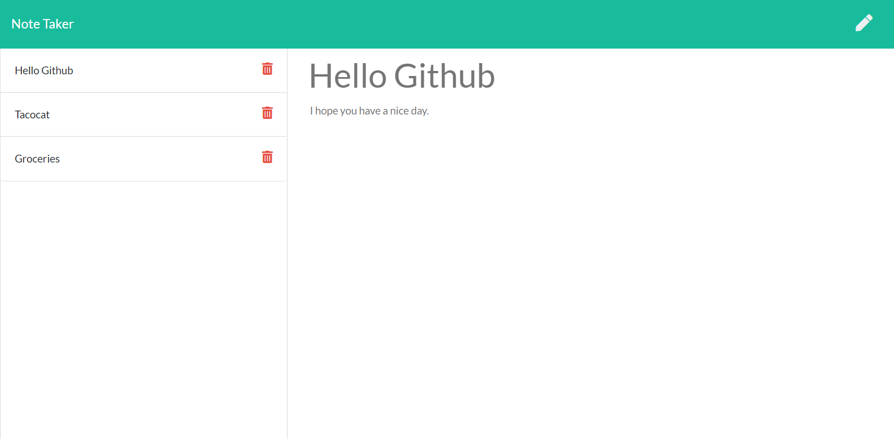

# Note-Taker

Assignment 9 for University of Toronto coding bootcamp.

## Project functionality

This assignment focused on taking a prebuilt front end application and creating a backend to handle get, post and delete calls using express to a json file which acted as a make shift database for persistence.

Live Demo: https://express-note-taker.herokuapp.com/

